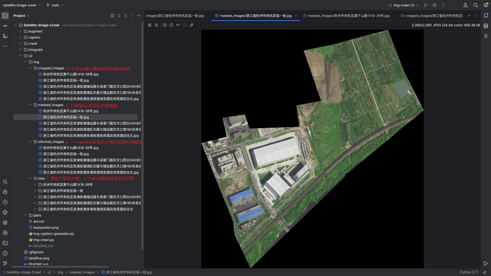
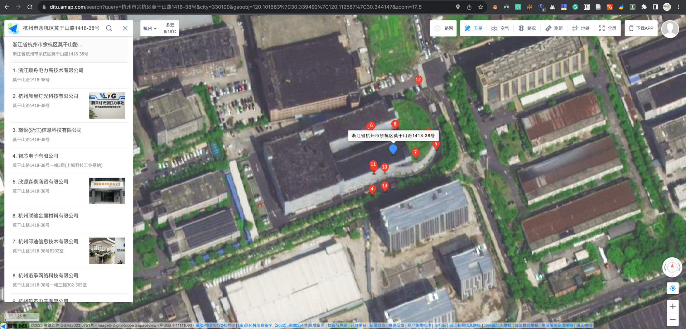
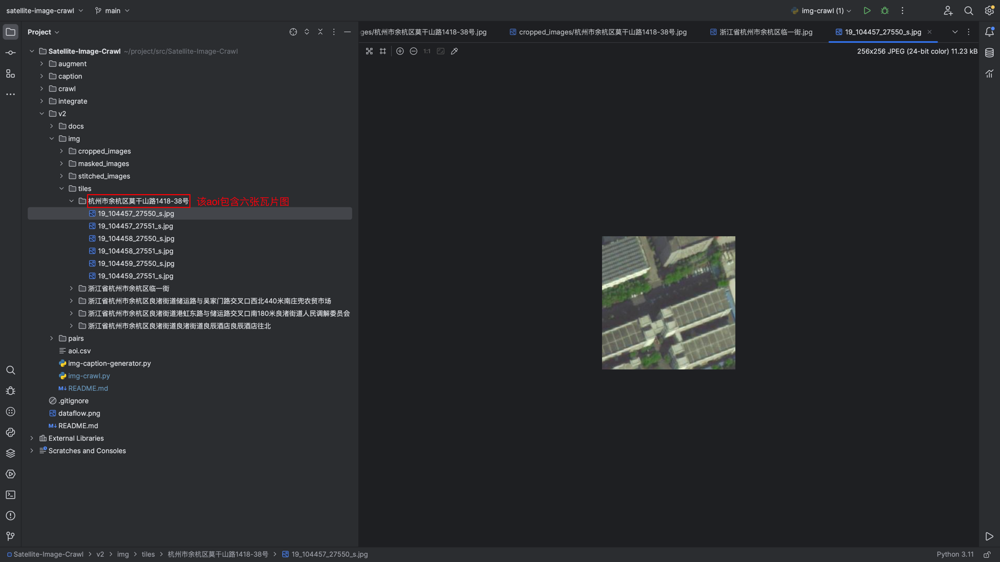

# AOI卫星影像抓取与处理工具

本项目是一个专门用于爬取并处理“感兴趣区域”（Area of Interest, AOI）的卫星影像的工具。AOI 是地理信息系统中的一个重要概念，指的是用户特别关注的某个地理区域。本工具能够基于高德地图提供的 AOI 坐标范围，抓取该区域在百度地图上对应的卫星影像。在此过程中，工具实现了高德地图与百度地图之间的坐标偏差转换，确保了结果的精确性。该工具适用于地理信息系统、城市规划、遥感分析等多个领域，能够对特定的地理区域进行详细的影像分析和处理。


## 功能特点

- **坐标转换**：实现高德地图坐标（GCJ-02）与百度地图坐标（BD-09）之间的转换，保证地理位置的精度。
- **瓦片下载**：根据高德地图提供的 AOI 坐标范围，从百度地图下载对应的地图瓦片。
- **图像拼接**：将下载的瓦片图像拼接成一个完整的大图像。
- **图像裁剪**：根据 AOI 的经纬度坐标裁剪出包含其区域的最小矩形图像。
- **多边形遮罩**：支持根据 AOI 的多边形区域对图像进行遮罩处理，突出特定区域。
- **并发下载**：利用多线程提高瓦片下载的效率。


## 使用说明

1. **配置百度地图 API 密钥**：
   在 `img-crawl.py` 文件中设置您的百度地图 API 密钥（变量 `ak`）。

2. **配置 aoi.csv**：参考 [aoi.csv](aoi.csv)，将需要下载的区域的信息以及覆盖多边形经纬度坐标写入文件中。
   在 `main` 函数中设置您要下载的区域的经纬度坐标。

3. **运行程序**：
   ```
   python img-crawl.py
   ```

4. **查看结果**：
   
   程序将在以下目录中输出图像：
   - `tiles`：原始下载的瓦片图，一个 AOI 可能包含多张瓦片图。
   - `stitched_images`：一个 AOI 对应的多张瓦片图合成后的完整图。
   - `cropped_images`：针对 AOI 最小覆盖矩形剪裁后的图。
   - `masked_images`：只保留 AOI 多边形区域的遮掩图。

## 样例说明
例如对于 “浙江省杭州市余杭区良渚街道储运路与吴家门路交叉口西北440米南庄兜农贸市场”，是一个以 `POINT (120.1035219 30.3410531)` 为中心，`POLYGON ((120.102565 30.341192, 120.103295 30.341317, 120.104293 30.341567, 120.104507 30.34103, 120.10286 30.340493, 120.102565 30.341192))`为多边形的一个 AOI(Area of Interest)，详细可见 [aoi.csv](aoi.csv)。

我们可以在[高德地图](https://ditu.amap.com/)上搜索到该AOI，打开卫星图模式查看其卫星影像，如下图所示：



我们运行的代码将会下载该AOI的卫星影像，并将其拼接、裁剪、遮罩处理，最终得到如下图所示的结果：
1. **瓦片图下载**：第一步会得到多个单张瓦片图，这里包含六张，可见[/img/tiles/杭州市余杭区莫干山路1418-38号](img%2Ftiles%2F%E6%9D%AD%E5%B7%9E%E5%B8%82%E4%BD%99%E6%9D%AD%E5%8C%BA%E8%8E%AB%E5%B9%B2%E5%B1%B1%E8%B7%AF1418-38%E5%8F%B7)，如下图所示：
   
2. **图像拼接**：第二步会将多个单张瓦片图拼接成一个完整的大图像，可见[/img/stitched_images/杭州市余杭区莫干山路1418-38号.jpg](img%2Fstitched_images%2F%E6%9D%AD%E5%B7%9E%E5%B8%82%E4%BD%99%E6%9D%AD%E5%8C%BA%E8%8E%AB%E5%B9%B2%E5%B1%B1%E8%B7%AF1418-38%E5%8F%B7.jpg)，如下图所示：
   
3. **图像裁剪**：第三步会根据该aoi的多边形经纬度坐标裁剪包含该aoi的最小矩形区域的图像，可见[[/img/cropped_images/杭州市余杭区莫干山路1418-38号.jpg](img%2Fcropped_images%2F%E6%9D%AD%E5%B7%9E%E5%B8%82%E4%BD%99%E6%9D%AD%E5%8C%BA%E8%8E%AB%E5%B9%B2%E5%B1%B1%E8%B7%AF1418-38%E5%8F%B7.jpg)，如下图所示：
   
4. **多边形遮罩**：第四步会根据指定的多边形区域对图像进行遮罩处理，突出特定区域，可见[[/img/masked_images/杭州市余杭区莫干山路1418-38号.jpg](img%2Fmasked_images%2F%E6%9D%AD%E5%B7%9E%E5%B8%82%E4%BD%99%E6%9D%AD%E5%8C%BA%E8%8E%AB%E5%B9%B2%E5%B1%B1%E8%B7%AF1418-38%E5%8F%B7.jpg)，如下图所示：
    


## 注意事项

- 确保在使用前正确配置百度地图 API 密钥。
- 根据下载区域的大小和图像分辨率，程序运行可能需要一定时间。